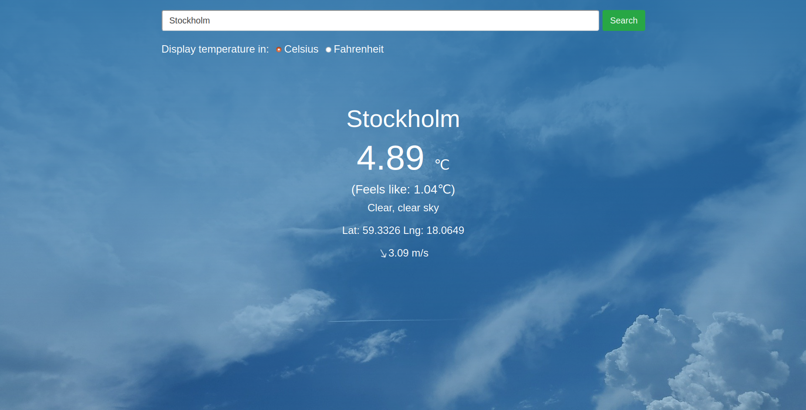
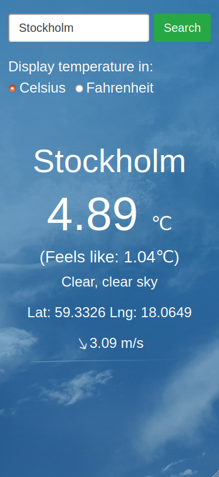

# Simple Weather Application

## About
This is a simple weather application fetching data from [Open Weather Map](https://openweathermap.org/).

The application is built using React on the client-side and Node.js and Express for the simple server-side part of the application.

API: [Open Weather Map](https://openweathermap.org/)

<!-- GETTING STARTED -->
## Getting Started

### Prerequisites

Make sure to have the following installed:

* [Node.js](https://nodejs.org/en/)

### Installation

1. Sign up and get a free API Key at [Open Weather Map](https://openweathermap.org/)
2. Clone the repo
  ```sh
  git clone https://github.com/Lennca/SimpleWeatherApp.git
  ```
3. Install NPM packages (in both `/frontend`, `/backend`, and `/`)
  ```sh
  npm install
  ```
4. Create and enter your API-key in the `.env` in the directory /backend
  ```JS
  WEATHER_API_KEY=<YOUR_API_KEY>
  ```
5. Create React chunk files (run following in `/frontend`)
  ```JS
  npm run build
  ```
6. Start the application
  ```JS
  npm start
  ```

## Usage

The application can display the degrees in Celsius (metric) and Fahrenheit (imperial).

The application display the data:
* Degrees
* Location
* Feel like temperature
* Description of weather
* Location (latitude and longitude) of place entered
* Wind-speed
* Wind-direction


### Screenshots




## License
Distributed under the MIT License. See `LICENSE` for more information.
